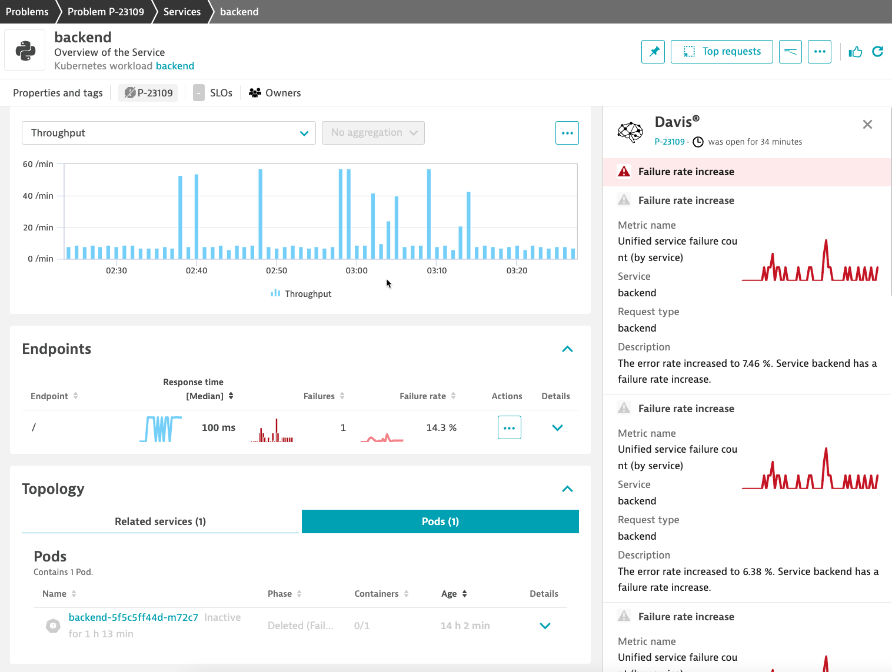

# sheep

This is a very simple app to demonstrate an Open Telemetry Collector with proper enrichment according the Dynatrace instructions [here](https://www.dynatrace.com/support/help/extend-dynatrace/opentelemetry/collector/use-cases/k8s-enrich). By using a collector approach we do not have to modify application source-code for enrichment.

## What you get

Davis, proper topology, logs, metrics, and traces in context.



## Tokens

Generate two Dynatrace tokens. Put an ingest token in `k8s/secret.yaml` along with your environment URL. Put an Operator token in dt-secret.yaml.

[token help](https://www.dynatrace.com/support/help/setup-and-configuration/setup-on-k8s/installation/tokens-permissions)

Also update `k8s/activegate.yaml` with your environment URL.

## Deploy an Operator with an AG

You need the ActiveGate (AG) to connect to the Kubernetes API. This enables all the Dynatrace Kubernetes screens.

```
kubectl create namespace dynatrace
kubectl apply -f https://github.com/Dynatrace/dynatrace-operator/releases/download/v0.13.0/kubernetes.yaml
kubectl -n dynatrace wait pod --for=condition=ready --selector=app.kubernetes.io/name=dynatrace-operator,app.kubernetes.io/component=webhook --timeout=300s
kubectl apply k8s/dt-secret.yaml
kubectl apply k8s/activegate.yaml
```

## Deploy the app

```
kubectl create namespace sheep
kubectl apply -f k8s/frontend.yaml -n sheep
kubectl apply -f k8s/backend.yaml -n sheep
kubectl apply -f k8s/generator.yaml -n sheep
kubectl apply -f k8s/collector.yaml -n sheep
kubectl apply -f k8s/secret.yaml -n sheep
```

After a few minutes you should see metrics, logs, and traces in Dynatrace Kubernetes screens.

## Stuff only Matt can do

To rebuild images and push to Dockerhub:

```
./build.sh
```

